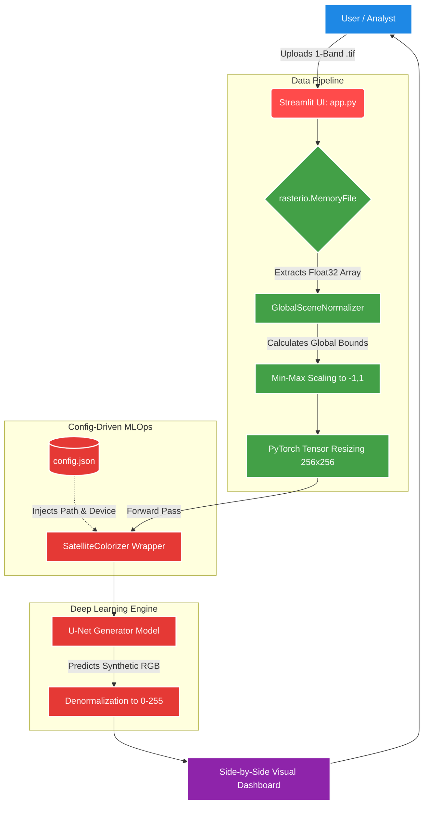
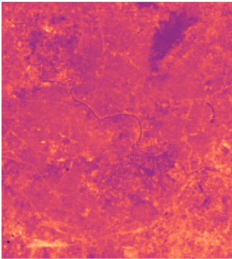
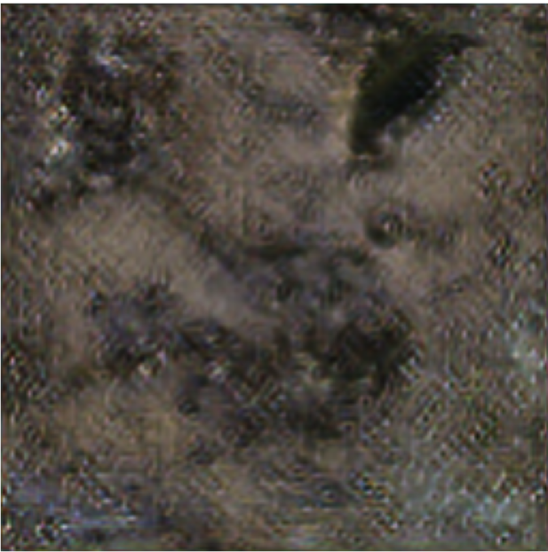

# 🛰️ ISRO BAC 2024 | PS-10: Thermal IR to RGB Enhancement Pipeline


> **Hackathon:** ISRO Bharatiya Antariksh Hackathon (BAC) 2024
> **Problem Statement 10:** Infrared Image Colorization & Enhancement

---

## 1. 🎯 The Problem Solved

Satellite Thermal Infrared (IR) telemetry (such as Landsat 8/9 Band 10) provides critical scientific data regarding surface temperatures. However, single-band monochrome IR data suffers from **low visual contrast** and **poor structural distinction**, making rapid human analysis difficult.

This project delivers an end-to-end Deep Learning pipeline that ingests raw, 1-channel thermal GeoTIFFs and translates them into **high-resolution, structurally accurate 3-channel RGB imagery**. This enables meteorologists and geospatial analysts to perceive urban, vegetative, and topological features hidden within thermal noise.

---

## 2. 🧠 Methodology

Our solution treats IR-to-RGB translation as an Image-to-Image translation problem, leveraging a **Generative Adversarial Network (GAN)** framework.

1. **Data Ingestion & Scaling:** Raw scientific telemetry contains values far beyond standard pixel ranges (e.g., 40,000+). We developed a `GlobalSceneNormalizer` to dynamically calculate bounds and scale inputs to a mathematically stable `[-1, 1]` tensor space.
2. **Generator Architecture:** A modified **U-Net** architecture with 8 downsampling/upsampling blocks.
3. **Artifact Mitigation:** To prevent the "checkerboard artifacts" common in transposed convolutions, our decoder utilizes **Bilinear Interpolation** paired with standard convolutional refinements.
4. **Hardware Agnosticism:** The pipeline is explicitly engineered to handle hardware abstraction, safely casting GPU-trained tensors to CPU resources for local, edge-device deployment.

---

## 3. 🏗️ Product Architecture



---

## 4. 📁 File & Folder Structure

The repository follows a clean, modular structure strictly separating front-end logic, back-end architecture, and configuration state.

```text
IR-IMG-ENHANCEMENT/
├── src/                        # Core ML logic and utilities
│   ├── __init__.py             # Exposes classes to the package root
│   ├── model.py                # U-Net architecture & SatelliteColorizer Wrapper
│   └── utils.py                # Geospatial normalization & Post-processing math
├── models/                     # Weights directory (Excluded from Git via .gitignore)
│   └── production_model.pth    # The active model weights (v1)
├── notebooks/
│   └── modelTraining.ipynb     # Colab training script & data scraping logic
├── app.py                      # Streamlit Dashboard (Frontend)
├── config.json                 # Decoupled deployment settings
├── requirements.txt            # Pin-pointed dependency map
└── README.md                   # Project documentation
```

---

## 5. 🛠️ Tech Stack

**Deep Learning & Math**


**Geospatial Processing**


**Frontend & Visualization**


---

## 6. 📊 Results & Evaluation

The model successfully synthesizes visible-spectrum features while preserving structural integrity. Evaluation was conducted on a validation set of unseen Landsat 8/9 patches.

### Quantitative Metrics

| Metric | Value | Threshold / Target |
| --- | --- | --- |
| **PSNR (Peak Signal-to-Noise Ratio)** | **19.05 dB** | Acceptable structural preservation |
| **SSIM (Structural Similarity Index)** | **0.33** | Captures baseline semantic geometries |
| **Inference Latency (App)** | **~0.599 sec** | Real-time / Production-ready |

### Qualitative Assessment (Visuals)

*Below is a demonstration of the raw thermal input mapped with a Magma colormap to highlight temperature gradients, alongside the AI-reconstructed visible-spectrum output. Replace these placeholders with your own screenshots before submitting.*

| Thermal Input (Magma Colormap) | AI-Reconstructed RGB Output |
| --- | --- |
|  |  |

---

## 7. 🚀 Scalability & MLOps (CI/CD Ready)

A critical requirement of modern AI is the ability to upgrade models with **zero downtime**.

This project implements a **Decoupled Configuration Architecture**. The application logic (`app.py` & `src/model.py`) never hard-codes model weights or hardware mappings. Instead, the application state is driven entirely by `config.json`.

**The CI/CD Workflow:**

1. A new, superior model is trained (e.g., `epoch_100.pth`).
2. The file is dropped into the `models/` registry.
3. The `config.json` is updated to point to the new model.
4. The application dynamically serves the new model on the next refresh **without a single line of Python code needing to be rewritten.**
5. Hardware mapping (`map_location='cpu'`) is strictly handled by the OOP wrapper, guaranteeing successful deployment on edge devices without NVIDIA GPUs.

---

## 8. 💻 Clone & Setup Instructions

To deploy this application locally on your machine, follow these precise steps:

**1. Clone the Repository**

```bash
git clone https://github.com/YourUsername/IR-img-enhancement.git
cd IR-img-enhancement
```

**2. Create and Activate a Virtual Environment**

```bash
# On Windows
python -m venv .venv
.venv\Scripts\activate

# On Mac/Linux
python3 -m venv .venv
source .venv/bin/activate
```

**3. Install Dependencies**

```bash
pip install -r requirements.txt
```

**4. Ensure Weights are Present**

*Note: Due to GitHub file limits, `production_model.pth` is not included in the repo. Ensure you place the model weights inside the `models/` directory as specified in `config.json`.*

**5. Launch the Dashboard**

```bash
streamlit run app.py
```

The application will open automatically in your default browser at `http://localhost:8501`.

---